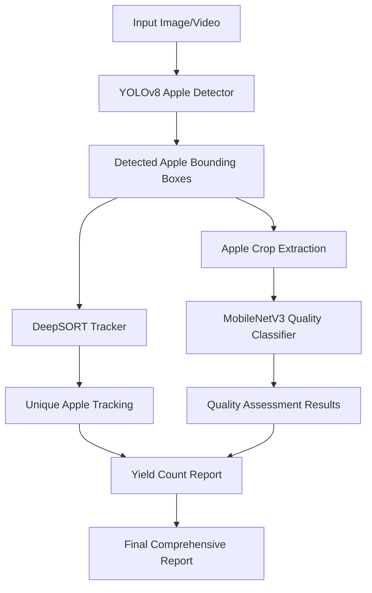

# 🍎 Apple Detection and Quality Grading Pipeline

A comprehensive computer vision pipeline for apple yield counting and quality grading using deep learning models. This system follows a two-stage approach: detection for yield estimation and classification for quality assessment.

[](https://www.python.org/downloads/)
[](https://pytorch.org/)
[](https://opensource.org/licenses/MIT)

## 🌟 Key Features

- **🎯 Yield Estimation**: Accurate apple detection and counting using YOLOv8
- **🔍 Quality Grading**: Defect classification using lightweight MobileNet
- **📹 Multi-Object Tracking**: DeepSORT integration for video-based counting
- **🌐 Web Deployment**: Gradio interface for easy demonstration
- **⚡ Resource Efficient**: Optimized for Google Colab free tier

## 📊 Performance Targets

- Detection mAP > 90%
- Quality Classification Accuracy > 92%
- Real-time inference (>15 FPS)
- Model size < 50MB for deployment

## 🏗️ Architecture Overview



## 🚀 Quick Start

### Installation

1. **Clone the repository:**
```bash
git clone https://github.com/your-username/apple-detection-pipeline.git
cd apple-detection-pipeline
```

2. **Create virtual environment:**
```bash
python -m venv venv
source venv/bin/activate  # On Windows: venv\Scripts\activate
```

3. **Install dependencies:**
```bash
pip install -r requirements.txt
```

### Basic Usage

#### 1. Process a Single Image

```python
from src.pipeline.apple_pipeline import ApplePipeline

# Initialize pipeline
pipeline = ApplePipeline(
    config_path='config/config.yaml'
)

# Process image
result = pipeline.process_image(
    image='path/to/apple_image.jpg',
    extract_quality=True
)

print(f"Detected {result.total_apples} apples")
print(f"Quality score: {result.quality_score:.3f}")
```

#### 2. Process Video with Tracking

```python
# Process video
results = pipeline.process_video(
    video_source='path/to/apple_video.mp4',
    save_video=True,
    output_path='output/processed_video.mp4'
)

# Generate report
report = pipeline.generate_report(results)
print(f"Total unique apples: {results[-1].unique_apples}")
```

#### 3. Launch Web Interface

```bash
python src/utils/gradio_interface.py --share
```

## 📁 Project Structure

```
cv_project/
├── config/                 # Configuration files
│   ├── config.yaml        # Main configuration
│   └── dataset.yaml       # Dataset configuration
├── src/                   # Source code
│   ├── models/           # Model implementations
│   │   ├── apple_detector.py
│   │   ├── quality_classifier.py
│   │   └── apple_tracker.py
│   ├── data/             # Data processing utilities
│   │   └── data_processing.py
│   ├── pipeline/         # Main pipeline
│   │   └── apple_pipeline.py
│   └── utils/            # Utilities
│       ├── gradio_interface.py
│       └── evaluation.py
├── scripts/              # Training scripts
│   ├── train_detection.py
│   ├── train_quality.py
│   └── train_pipeline.py
├── tests/                # Unit tests
├── notebooks/            # Jupyter notebooks
├── models/               # Saved model weights
├── datasets/             # Dataset storage
├── results/              # Output results
└── requirements.txt      # Dependencies
```

## 🎯 Model Training

### Training Detection Model

```bash
python scripts/train_detection.py \
    --config config/config.yaml \
    --epochs 100 \
    --batch-size 16 \
    --device cuda
```

### Training Quality Classification Model

```bash
python scripts/train_quality.py \
    --config config/config.yaml \
    --epochs 50 \
    --batch-size 32 \
    --device cuda
```

### Training Complete Pipeline

```bash
python scripts/train_pipeline.py \
    --config config/config.yaml
```

## 📊 Dataset Preparation

### Detection Dataset (YOLO Format)

```
datasets/detection/
├── images/
│   ├── train/          # Training images
│   ├── val/            # Validation images
│   └── test/           # Test images
├── labels/
│   ├── train/          # YOLO format labels
│   ├── val/
│   └── test/
└── dataset.yaml        # Dataset configuration
```

### Quality Dataset (Classification Format)

```
datasets/quality/
├── train/
│   ├── good/           # High-quality apples
│   ├── minor_defect/   # Minor defect samples
│   └── major_defect/   # Major defect samples
├── val/
└── test/
```

### Data Preparation Script

```python
from src.data.data_processing import DataManager

# Initialize data manager
data_manager = DataManager('config/config.yaml')

# Download from Roboflow (optional)
dataset_path = data_manager.download_roboflow_dataset(
    workspace="your-workspace",
    project="apple-detection",
    version=1,
    api_key="your-api-key"
)

# Split dataset
data_manager.split_dataset(
    source_dir="raw_dataset",
    output_dir="datasets/detection",
    train_ratio=0.8,
    val_ratio=0.1,
    test_ratio=0.1
)
```

## ⚙️ Configuration

The system uses YAML configuration files for easy customization:

```yaml
# config/config.yaml
model:
  detection:
    confidence_threshold: 0.3
    iou_threshold: 0.5
  quality_classification:
    input_size: [224, 224]
    num_classes: 3
  tracking:
    max_age: 30
    min_hits: 3

training:
  detection:
    epochs: 100
    batch_size: 16
    learning_rate: 0.001
  quality_classification:
    epochs: 50
    batch_size: 32
    learning_rate: 0.001

performance:
  detection:
    target_map50: 0.90
  quality_classification:
    target_accuracy: 0.92
```

## 📱 Web Interface

Launch the interactive web interface for easy testing:

```bash
python src/utils/gradio_interface.py \
    --detection-model models/detection/best.pt \
    --quality-model models/quality/best.pth \
    --share
```

Features:
- 📷 Image processing with real-time results
- 🎥 Video processing with tracking visualization
- 📊 Detailed analytics and reports
- 📈 Processing history tracking

## 🧪 Testing

### Run Unit Tests

```bash
# Run all tests
python -m pytest tests/ -v

# Run specific test module
python -m pytest tests/test_apple_detector.py -v

# Run with coverage
python -m pytest tests/ --cov=src --cov-report=html
```

### Integration Testing

```bash
python scripts/test_pipeline.py \
    --test-images tests/data/test_images/ \
    --config config/config.yaml
```

## 📈 Evaluation and Metrics

### Evaluate Detection Model

```python
from src.utils.evaluation import DetectionEvaluator

evaluator = DetectionEvaluator()
results = evaluator.evaluate_detections(predictions, ground_truths)

print(f"mAP: {results['mAP']:.4f}")
print(f"Precision: {results['conf_0.5']['precision']:.4f}")
print(f"Recall: {results['conf_0.5']['recall']:.4f}")
```

### Evaluate Classification Model

```python
from src.utils.evaluation import ClassificationEvaluator

evaluator = ClassificationEvaluator()
results = evaluator.evaluate_classification(predictions, ground_truths)

print(f"Accuracy: {results['accuracy']:.4f}")
print(f"Macro F1: {results['f1_macro']:.4f}")
```

### Generate Reports

```python
from src.utils.evaluation import ReportGenerator

generator = ReportGenerator()
report_path = generator.generate_detection_report(evaluation_results)
print(f"Report saved to: {report_path}")
```

## 🚀 Deployment

### Docker Deployment

```dockerfile
FROM python:3.8-slim

WORKDIR /app
COPY requirements.txt .
RUN pip install -r requirements.txt

COPY . .
EXPOSE 7860

CMD ["python", "src/utils/gradio_interface.py", "--host", "0.0.0.0"]
```

### Google Colab Deployment

Open the provided Colab notebook for easy cloud deployment:

[](https://colab.research.google.com/github/your-username/apple-detection-pipeline/blob/main/notebooks/apple_detection_colab.ipynb)

## 🔧 API Reference

### ApplePipeline Class

```python
class ApplePipeline:
    def __init__(self, config_path: str = None, 
                 detection_model_path: str = None,
                 quality_model_path: str = None,
                 device: str = 'auto')
    
    def process_image(self, image: Union[str, np.ndarray],
                     extract_quality: bool = True,
                     return_annotated: bool = True) -> PipelineResult
    
    def process_video(self, video_source: Union[str, int],
                     extract_quality: bool = True,
                     save_video: bool = False,
                     output_path: str = None) -> List[PipelineResult]
    
    def generate_report(self, results: List[PipelineResult]) -> Dict
```

### AppleDetector Class

```python
class AppleDetector:
    def __init__(self, model_path: str = None,
                 model_size: str = 'n',
                 device: str = 'auto',
                 conf_threshold: float = 0.3,
                 iou_threshold: float = 0.5)
    
    def detect(self, source: Union[str, np.ndarray]) -> List[Dict]
    def train(self, data_yaml: str, epochs: int = 100) -> object
    def validate(self, data_yaml: str = None) -> Dict
```

### QualityClassificationPipeline Class

```python
class QualityClassificationPipeline:
    def __init__(self, model: QualityClassifier = None,
                 device: str = 'auto',
                 input_size: Tuple[int, int] = (224, 224))
    
    def classify_single(self, image: Union[str, np.ndarray]) -> Tuple[str, float]
    def train(self, train_loader: DataLoader, val_loader: DataLoader,
              epochs: int = 50) -> Dict
    def evaluate(self, test_loader: DataLoader) -> Dict
```

## 🛠️ Advanced Usage

### Custom Model Training

```python
# Custom detection training with advanced parameters
from src.models.apple_detector import AppleDetector

detector = AppleDetector(model_size='s')
results = detector.train(
    data_yaml='custom_dataset.yaml',
    epochs=200,
    batch_size=32,
    learning_rate=0.001,
    patience=30,
    augment=True,
    mosaic=0.8,
    mixup=0.2
)
```

### Batch Processing

```python
# Process multiple images in parallel
image_paths = ['img1.jpg', 'img2.jpg', 'img3.jpg']
results = pipeline.process_batch(
    image_paths,
    extract_quality=True,
    max_workers=4
)
```

### Export Models for Deployment

```python
# Export detection model to ONNX
detector.export_model(format='onnx', output_path='apple_detector.onnx')

# Export quality model to TorchScript
quality_model = torch.jit.script(classifier.model)
torch.jit.save(quality_model, 'quality_classifier.pt')
```

## 🐛 Troubleshooting

### Common Issues

1. **CUDA Out of Memory**
   ```python
   # Reduce batch size in config
   training:
     detection:
       batch_size: 8  # Reduce from 16
   ```

2. **Import Errors**
   ```bash
   # Ensure PYTHONPATH includes src directory
   export PYTHONPATH="${PYTHONPATH}:$(pwd)/src"
   ```

3. **Model Loading Issues**
   ```python
   # Check model paths and device compatibility
   device = 'cpu' if not torch.cuda.is_available() else 'cuda'
   pipeline = ApplePipeline(device=device)
   ```

### Performance Optimization

1. **Enable Mixed Precision Training**
   ```python
   # Add to training config
   use_amp: true
   ```

2. **Optimize Inference**
   ```python
   # Use TensorRT for NVIDIA GPUs
   detector.export_model(format='engine')
   ```

3. **Memory Management**
   ```python
   # Clear cache between batches
   torch.cuda.empty_cache()
   ```

## 📄 License

This project is licensed under the MIT License - see the [LICENSE](LICENSE) file for details.

## 🤝 Contributing

1. Fork the repository
2. Create a feature branch (`git checkout -b feature/amazing-feature`)
3. Commit your changes (`git commit -m 'Add amazing feature'`)
4. Push to the branch (`git push origin feature/amazing-feature`)
5. Open a Pull Request

## 📧 Contact

- **Author**: Your Name
- **Email**: your.email@example.com
- **Project Link**: https://github.com/your-username/apple-detection-pipeline

## 🙏 Acknowledgments

- [Ultralytics YOLOv8](https://github.com/ultralytics/ultralytics) for object detection
- [PyTorch](https://pytorch.org/) for the deep learning framework
- [Gradio](https://gradio.app/) for the web interface
- [DeepSORT](https://github.com/nwojke/deep_sort) for multi-object tracking
- MinneApple dataset for training data

## 📚 Citation

If you use this project in your research, please cite:

```bibtex
@software{apple_detection_pipeline,
  title={Apple Detection and Quality Grading Pipeline},
  author={Your Name},
  year={2024},
  url={https://github.com/your-username/apple-detection-pipeline}
}
```

---

⭐ **Star this repository if it helped you!**